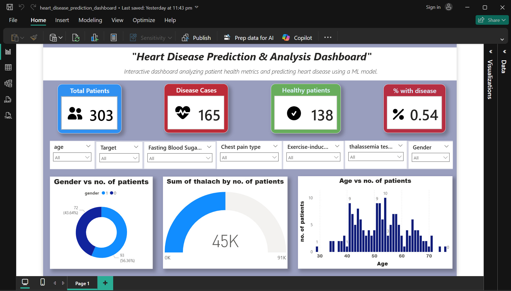

# 🫀 Heart Disease Prediction and Visualization

This project combines **Machine Learning (using a Decision Tree Classifier)** and **Power BI Visualization** to analyze and predict the presence of heart disease based on patient health parameters.

---

## 📁 Files Included

| File / Folder            | Description                                              |
|--------------------------|----------------------------------------------------------|
| `Heart_disease_prediction.ipynb`    | Jupyter Notebook containing the ML model (Decision Tree) |
| `heart.csv`      | Original dataset                                         |
| `heart_disease_cleaned.csv` | Cleaned dataset (after EDA and preprocessing)       |
| `heart_disease_dashboard.pbix` | Power BI dashboard file                         |
| `heart_disease_prediction_ss.png`          | Screenshot of the final dashboard                        |
| `/icons/`                | Icons used in dashboard cards   
---

## 🎯 Objective

To predict the likelihood of heart disease using patient health data and present the insights with a clean, informative dashboard.

---

## 🧠 Machine Learning Approach (Jupyter Notebook)

### ✔ Dataset Features Used:
- `age`, `sex`, `cp (chest pain type)`, `trestbps`, `chol`, `fbs`, `restecg`,  
  `thalach`, `exang`, `oldpeak`, `slope`, `ca`, `thal`

### ✔ Target:
- `target`: 1 = heart disease present, 0 = no disease

### ✔ Key Steps:
1. Data cleaning & preprocessing
2. Training a Decision Tree Classifier
3. Evaluating model using:
   - Accuracy score
   - Confusion matrix
   - Sample prediction input
4. Saving the model for prediction use

---

## 📊 Power BI Dashboard

### ✔ Insights Visualized:
- Total patients
- Heart disease vs. healthy distribution
- CP type (Chest Pain Type) breakdown
- Age distribution with disease status
- Gender-wise heart disease comparison
- % of patients with heart disease

### ✔ Features:
- **Slicers**: Gender, Age, Chest Pain Type, Thal, etc.
- **Conditional Formatting**:
  - Card border turns red if `% with disease > 50%`
    
## 🎨 Color Coding Scheme for Dashboard Cards

This dashboard uses a consistent and intuitive color palette to highlight key health indicators:

| Card                     | Value Description             | Color Logic                                      |
|--------------------------|-------------------------------|--------------------------------------------------|
| 🔵 **Total Patients**     | All patient records           | Blue background                                  |
| 🔴 **Heart Disease Cases**| Patients with `target = 1`    | Red background                                   |
| 🟢 **Healthy Patients**   | Patients with `target = 0`    | Green background                                 |
| 🟥/🟩 **% With Disease**   | `target = 1 / total patients` | 🔴 Red if > 50%, 🟢 Green if ≤ 50% (conditional)  |

> ✅ Color assignments are also reflected in Power BI cards using static and dynamic (DAX-based) conditional formatting for better visual interpretation.

### ✔ Summary Cards:
- 🧑 Total Patients  
- ❤️ Disease Cases  
- ✅ Healthy Patients  
- 📈 % With Disease

---

## ⚙️ Tools Used

- **Python** (Jupyter Notebook)
  - Libraries: pandas, numpy, sklearn, matplotlib
- **Power BI**
  - Data modeling, DAX, slicers, cards, charts
- **GitHub** for version control and collaboration

---

## 🔮 How to Use

1. Clone the repo or download the `.ipynb` and `.pbix` files.
2. Run the Jupyter Notebook to understand model building.
3. Open `.pbix` in Power BI Desktop to explore the interactive dashboard.

---

## 📊 Dashboard Preview

---

## 🤝 Acknowledgements

- Dataset based on UCI Heart Disease Dataset
- Inspired by the need for accessible and interpretable ML + BI healthcare solutions

---

## 📌 Future Improvements

- Integrate other ML models (Random Forest, Logistic Regression)
- Deploy prediction app using Streamlit or Flask
- Add live data integration in Power BI

---

## 📫 Contact

Feel free to connect with me on [LinkedIn](https://www.linkedin.com/in/saurabhtanwer/) or raise issues for feedback!

---
